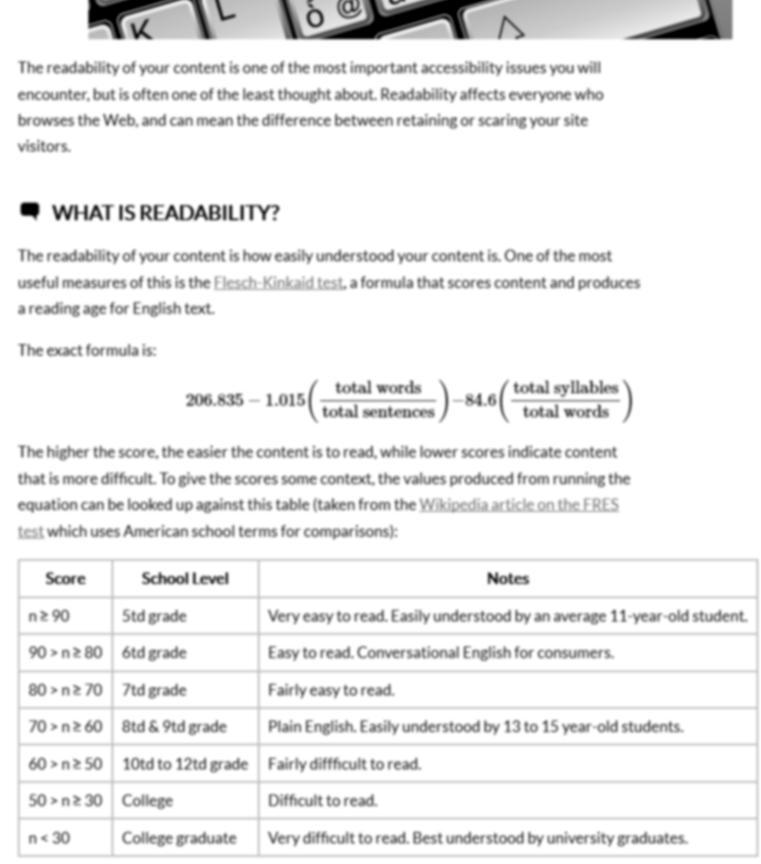

# Site Accessibility Tester Add-on for Firefox

This is a work-in-progress add-on for Firefox to serve as an aid to developers ensuring their web content is accessible.

While it's in the initial stages of development, it will only be available as a Temporary Add-on.

## Installation

* Check out the repository locally
* Open Firefox and point to `about:debug` in the address bar
* Click on the `Load Temporary Add-on...` button and navigate to the project directory and load the `manifest.json` file there

## Using the Add-on

_Note: This add-on will only be available for the current session that it's loaded due to it being in a temporary load state._

Once the add-on has been loaded, visit any page, and open the Firefox developer tools (`F12` on most systems). This will show a menu similar to the following:

### The Tests

Tests are grouped under the Layout, Visual, or Audible tabs, depeding on the type of test. Each one will either affect the current page being viewed (such as one of the colour blindness filters) or it will output an error to the browsers console window (if there is any error to report).

For example, running the "Heading Levels" test on the `test sources/heading fail test.html` page of the project will give an error report in the console similar to this:

The colour blindness and blur filter tests affect the page currently being viewed, and have no error output in the console. These tests are to help simulate the page under particular visual conditions, so that you can more easily identify any problem areas. Running the blur and achromatopsia colour blindness tests on my [How Readable is Your Content? blog post](http://www.ashleysheridan.co.uk/blog/How+Readable+is+Your+Content%3F) will show something similar to this:

## Planned Updates

* Improved error output and better messaging when there's no error to show
* Publishing this as a full plugin
* More tests (obviously)